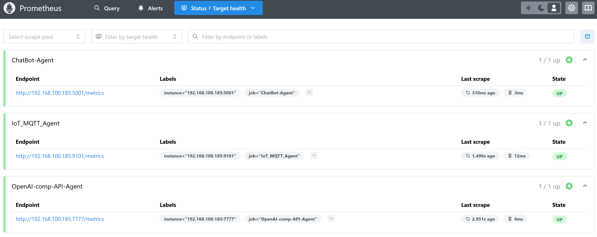
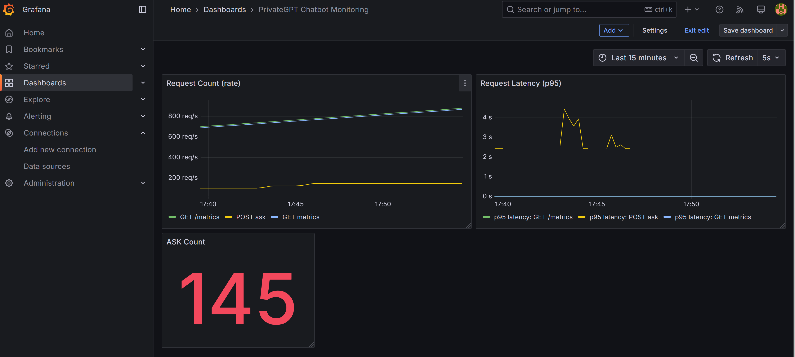

# README

## Overview
To monitor the three different **agents**, each providing Prometheus metrics so they can be monitored in **Prometheus** and visualized in **Grafana**:

1. **OpenAI-Compatible API Agent**  
   - By default runs on **port 7777** and serves `/metrics`.
2. **Chatbot Agent**  
   - Runs on **port 5001** (by default), and also exposes `/metrics` (or configurable via JSON).
3. **IoT MQTT Agent**  
   - Runs on a **Prometheus port** specified in its JSON config (e.g., `9101`), providing `/metrics` via a custom WSGI server.

### Requirements
- Install each agent’s dependencies (e.g., via `pip install -r requirements.txt`), including the **`prometheus_client`** library.hon 3.8+** is
- You need **Prometheus** and **Grafana** set up to ingest and display these metrics.

---

## 1. OpenAI-Compatible API Agent
- By default, runs on **port 7777**.
- `/metrics` will be served at **`http://<host>:7777/metrics`**.

### How to Start
Switch to the agent’s directory and start the agent as desribed in the agent's `README.md`

You should see in the logs something like:
```
Starting API on http://0.0.0.0:7777
Starting Prometheus metrics server on port 7777...
```

### Metrics
- Typical metrics might include:
  - `request_count{method,endpoint}`
  - `request_latency_seconds{method,endpoint}`
  - `chat_completion_count`
  - `completion_count`
  - etc.

**Note:** Search and select the metrics that suit you in the Grafana dashboard.

---

## 2. Chatbot Agent
- Runs on **port 5001** by default.
- Also serves Prometheus metrics under **`http://<host>:5001/metrics`** (or whichever port is in use).

### How to Start
Switch to the agent’s directory and start the agent as desribed in the agent's `README.md`

You’ll see logs like:
```
Starting API server on 0.0.0.0:5001
Starting Prometheus WSGI server on port 5001...
```
Then `/metrics` is accessible.

### Metrics
- Common metrics:
  - `request_count` / `request_latency_seconds`
  - `agent_ask_count`
  - etc.

**Note:** Search and select the metrics that suit you in the Grafana dashboard.

---

## 3. IoT MQTT Agent
- Reads a **port** from its JSON config (`pgpt_iot_agent.json`), e.g.:

  ```json
  {
    "metrics": {
      "port": 9101
    }
    ...
  }
  ```

- The agent starts a small WSGI server on `metrics.port` and exposes `/metrics`.

### How to Start
Switch to the agent’s directory and start the agent as desribed in the agent's `README.md`

Logs should show:
```
Starting Prometheus WSGI server on port 9101...
```
Hence `http://<host>:9101/metrics` gives the metrics.

### Metrics
- For example:
  - `mqtt_message_count` (number of MQTT messages received)
  - `mqtt_message_latency_seconds` (histogram measuring processing latency)

**Note:** Search and select the metrics that suit you in the Grafana dashboard.

---

## 4. Prometheus Configuration
To let Prometheus scrape these metrics, add **targets** for all three agents in your `prometheus.yml`. For example:

```yaml
global:
  scrape_interval: 15s
  evaluation_interval: 15s

scrape_configs:

  # 1) OpenAI-Compatible API Agent
  - job_name: "openai_compatible_agent"
    scrape_interval: 5s
    static_configs:
      - targets:
          - "192.168.123.123:7777"  # your openai compatible API agent ip and port

  # 2) Chatbot Agent
  - job_name: "chatbot_agent"
    scrape_interval: 5s
    static_configs:
      - targets:
          - "192.168.123.123:5001"  # your chatbot ip and port

  # 3) IoT MQTT Agent
  - job_name: "iot_mqtt_agent"
    scrape_interval: 5s
    static_configs:
      - targets:
          - "192.168.123.123:9101"  # your IoT agent ip and port
```

> Change **`192.168.123.123`** to your actual IP or hostname; use `localhost` (`127.0.0.1`) if everything is local.  
> And verify the ports:  
> - **`7777`** (OpenAI-Compatible)  
> - **`5001`** (Chatbot)  
> - **`9101`** (IoT)

Once Prometheus is running (e.g., via Docker or binary), navigate to `http://<prometheus-host>:9090/targets` and confirm all three jobs appear and show **UP**:



---

## 5. Grafana Dashboards
This repo provides **Grafana Dashboard JSON** files for each agent. You can import them to visualize the metrics.

### A) OpenAI-Compatible API Agent Dashboard
- File: `OpenAI compatible API - Agent Dashboard Example - Grafana.json` (example)
- Contains panels such as:
  - *Request Count (rate)*
  - *Request Latency (p95)*
  - *Chat Completion Count*
  - and more.

#### Import Procedure
1. In Grafana: **Dashboards** → **Import**.
2. Paste the JSON from `OpenAI compatible API - Agent Dashboard Example - Grafana.json`.
3. Select your **Prometheus** data source.
4. Click **Import**.

### B) Chatbot Agent Dashboard
- File: `ChatBot-Agent Dashboard Example - Grafana.json`.
- Shows metrics such as `agent_ask_count`, `request_latency_seconds`, etc.

#### Import Steps
1. Go to Grafana → **Import**.
2. Paste the JSON content.
3. Select your Prometheus data source.
4. Save the dashboard.

Example below:



### C) IoT MQTT Agent Dashboard
- File: `IoT-Agent Dashboard Example - Grafana.json`.
- Example panels:
  - Rate of MQTT messages (`rate(mqtt_message_count[1m])`)
  - Total MQTT messages
  - Latencies (e.g., 95th percentile for `mqtt_message_latency_seconds_bucket`)

#### Import Steps
Identical approach:
1. **Dashboards** → **Import**.
2. Paste JSON from `IoT-Agent Dashboard Example - Grafana.json`.
3. Pick **Prometheus** as the data source.

---

## 6. Parameters to Adjust
1. **Agent Ports**  
   - Update ports in the respective JSON configs or Python code to avoid port collisions.  
   - Defaults:
     - **OpenAI-Compatible**: `7777`  
     - **Chatbot**: `5001`  
     - **IoT**: `9101` (via `metrics.port` in JSON)

2. **Prometheus `prometheus.yml`**  
   - Change the **targets** to match your IP addresses/ports.  
   - Adjust `scrape_interval` if needed (default is 15s).

3. **Grafana**  
   - When importing each JSON, make sure to choose **the correct Prometheus data source** if you have multiple.  
   - If panels show “No data,” double-check that Prometheus is indeed scraping the relevant metrics.

---

## 7. Troubleshooting
- **“No data”** in Grafana:
  - Check Prometheus at `/targets` to see if the jobs are **UP**.
  - Check Prometheus’s expression browser for the metrics (e.g., `mqtt_message_count`).
- **Port collisions**:
  - If `7777`, `5001`, `9101` are already in use, adjust them in code/JSON.
- **Authentication errors**:
  - If the agent has an API key for `/metrics`, you may need to disable that or specifically allow `/metrics` to be unauthenticated.
- **Docker environment**:
  - Ensure you map the correct ports (e.g., `-p 5001:5001`) and use the correct IP addresses.

---

## Conclusion
With these three agents, you can gather both **LLM-related** (OpenAI-Compatible & Chatbot) and **IoT-related** (MQTT agent) metrics in **Prometheus**, then visualize everything in **Grafana** using the provided dashboards. Enjoy your fully monitored environment!